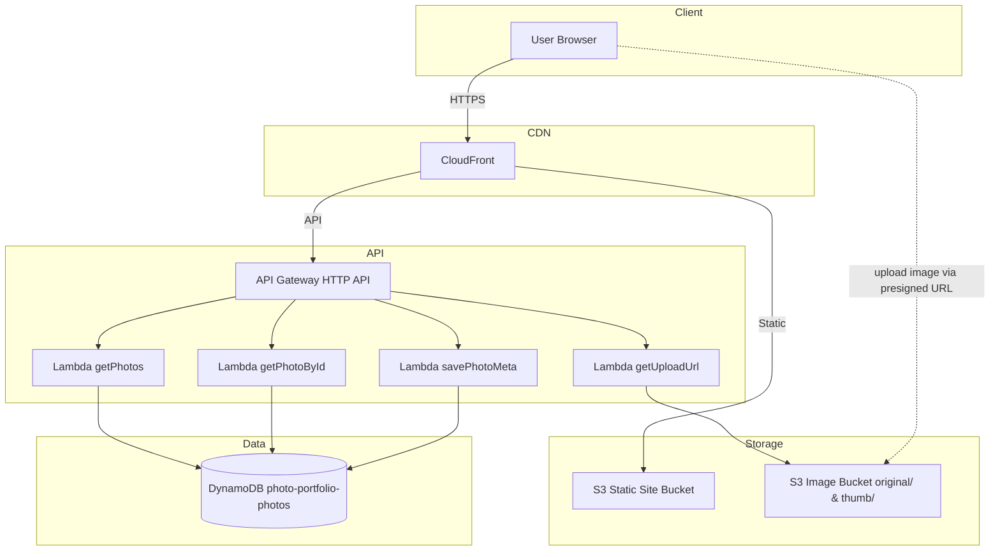

# Architecture Overview

## Diagram (Mermaid)

## Component Roles & Data Flow
- **CloudFront**: single CDN entry. Serves static frontend from S3 and forwards `/api/*` to API Gateway (using a behavior/path pattern).
- **S3 (static)**: stores Vite-built frontend bundle. CloudFront origin for the website.
- **S3 (images)**: stores uploaded photos, separated into `original/` and `thumb/` prefixes. Lambda generates pre-signed URLs for direct browser uploads.
- **API Gateway (HTTP API)**: REST entry for Lambda handlers.
- **Lambda (Node.js 20, TS)**: four handlers for listing, detail, presigned URL, and metadata save/update. Uses AWS SDK v3.
- **DynamoDB**: stores photo metadata keyed by `photoId` (string). Contains title, description, tags, location, shootDate, s3Key, createdAt, isPublic.
- **Flow**:
  1. Browser requests site via CloudFront → static assets from S3.
  2. For data, browser calls CloudFront `/api/...` → API Gateway → Lambda.
  3. For uploads: browser calls `POST /photos/upload-url` → Lambda returns pre-signed URL + `s3Key` → browser uploads file directly to image S3 bucket under `original/` prefix.
  4. After successful upload, browser calls `POST /photos` to persist metadata (including returned `s3Key`).

